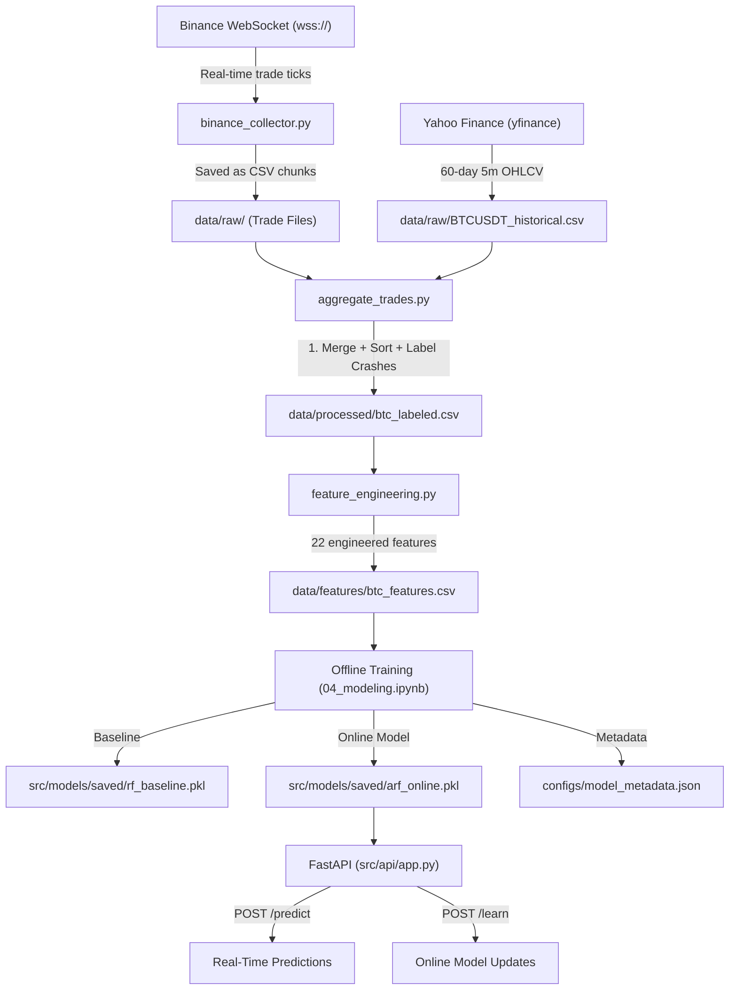

# Cryptocurrency Flash Crash Predictor

> A production-grade, end-to-end Online Machine Learning system for real-time cryptocurrency flash crash prediction using streaming market data, incremental learning, and a REST API.

---

## Table of Contents

1. [Problem Statement](#problem-statement)
2. [Project Objective](#project-objective)
3. [Approach & Methodology](#approach--methodology)
4. [System Architecture](#system-architecture)
5. [Data Pipeline](#data-pipeline)
6. [Feature Engineering](#feature-engineering)
7. [Machine Learning Models](#machine-learning-models)
8. [Results & Evaluation](#results--evaluation)
9. [Tech Stack](#tech-stack)
10. [Project Structure](#project-structure)
11. [Setup & Running Locally](#setup--running-locally)
12. [API Endpoints](#api-endpoints)
13. [Known Limitations & Future Work](#known-limitations--future-work)

---

## Problem Statement

**Flash crashes** are sudden, severe price drops in financial markets that happen within seconds to a few minutes. In crypto markets, these events are especially dangerous due to:

- **24/7 trading** with no circuit breakers like traditional markets
- **High leverage** — retail traders can lose everything in one crash
- **Thin liquidity** — a single large sell order can cascade into a collapse
- **No regulatory protection** — crypto markets are largely unregulated

A **1.5%+ price drop in 15 minutes** on BTC/USDT can cascade into a full liquidation cascade wiping out millions in leveraged positions. The window to react is often **less than 5 minutes**.

**Traditional approaches** to monitoring market risk rely on:
- Static rule-based alerts (e.g., "alert if RSI < 30")
- Batch ML models retrained weekly/monthly
- Manual monitoring dashboards

These approaches **fail to adapt** to evolving market regimes (bull markets vs. bear markets behave very differently) and cannot learn from new data in real-time.

---

## Project Objective

Build a **production-ready Online Machine Learning pipeline** that:

1. **Ingests** live Bitcoin price ticks from the Binance WebSocket API in real-time
2. **Aggregates** ticks into OHLCV candles (5-minute interval)
3. **Engineers** statistically-motivated features from price action, volatility, volume, and time
4. **Trains** an Adaptive Random Forest (ARF) classifier that learns continuously from each new data point
5. **Detects** concept drift (market regime changes) using the ADWIN algorithm
6. **Serves** real-time crash risk predictions via a FastAPI REST API
7. **Monitors** system health and model performance via a live dashboard

---

## Approach & Methodology

### Why Online Learning?

Classical (batch) ML models are trained once and deployed statically. In financial markets, this is dangerous because:

| Property | Batch RF | Online ARF |
|----------|----------|------------|
| Retraining | Weekly/Monthly | Every tick |
| Regime Adaptation | ❌ Cannot adapt | ✅ Adapts continuously |
| Concept Drift Detection | ❌ Not built-in | ✅ ADWIN integrated |
| Memory Footprint | High (full dataset) | Low (stream only) |
| Latency | Hours to retrain | Milliseconds per update |

### Crash Definition

A crash is defined as a **≥1.5% price drop within 15 minutes (3 consecutive 5-minute candles)** from the current time. This is implemented using a look-ahead labeling strategy on historical data:

```python
df['future_return'] = df['close'].pct_change(periods=3).shift(-3)
df['crash'] = (df['future_return'] <= -0.015).astype(int)
```

This deliberately captures **pre-crash signals** — the model learns market patterns that appear BEFORE the crash happens.

### Training Strategy

- **Historical Baseline**: 60 days of 5-minute BTC/USD candles from Yahoo Finance are used to pre-train the Offline Random Forest (baseline benchmark).
- **Online Learning**: The Adaptive Random Forest is trained incrementally using prequential evaluation — it **predicts first, then learns** from each sample. This is the only statistically sound evaluation method for online learners.
- **Class Imbalance**: Crash events are rare (~2% of all candles). The offline RF uses `class_weight='balanced'`. The ARF handles this through its ensemble structure.

---

## System Architecture



### Key Design Decisions

| Decision | Rationale |
|----------|-----------|
| **Yahoo Finance for historical data** | Binance API is geo-blocked in India. Yahoo Finance provides free, accessible OHLCV data. |
| **Binance WebSocket for live data** | WebSocket feeds provide real-time tick-by-tick data including buyer/seller tagging. |
| **5-minute candles** | Balances granularity (enough signal) vs noise (1-minute candles are too noisy for crash signals). |
| **River library for online ML** | Production-grade Python library for streaming/online machine learning with built-in drift detection. |
| **FastAPI** | High-performance async REST API with automatic OpenAPI documentation. |

---

## Data Pipeline

### Data Sources

| Source | Type | Coverage | Resolution |
|--------|------|----------|------------|
| **Yahoo Finance** (`yfinance`) | Historical OHLCV | Last 60 days | 5-minute candles |
| **Binance WebSocket** | Live trade ticks | Real-time | Per-trade (ms) |

### Pipeline Stages

```
Stage 1: Collection
├── binance_collector.py  → Streams live ticks to data/raw/BTCUSDT_*.csv
└── Yahoo Finance API     → Downloads historical OHLCV to data/raw/BTCUSDT_historical.csv

Stage 2: Aggregation (aggregate_trades.py)
├── Load and merge all raw trade files
├── Aggregate live ticks into 5-minute OHLCV candles
├── Merge historical + live candles (timezone-normalized)
├── Deduplicate and sort by timestamp
└── Label crashes using look-ahead window

Stage 3: Feature Engineering (feature_engineering.py)
├── Compute 22 technical + statistical features
├── Drop NaN rows (rolling warmup period)
└── Save to data/features/btc_features.csv

Stage 4: Modeling (notebooks/04_modeling.ipynb)
├── Time-based train/test split (80/20 chronological)
├── Train Offline Random Forest (baseline)
├── Train Online ARF with prequential evaluation
├── Threshold tuning analysis
└── Save trained models to src/models/saved/
```

### Data Flow Notes

- **Timezone Handling**: Both Yahoo Finance (UTC) and Binance WebSocket data are normalized to timezone-naive UTC before merging.
- **Column Consistency**: Both sources are mapped to standard `[timestamp, open, high, low, close, volume]` schema before feature engineering.
- **Yahoo Finance Limitation**: `buy_volume`, `sell_volume`, and `buy_sell_ratio` are unavailable from Yahoo Finance and are stored as `NaN`. These columns are not used in feature engineering, so this has no impact on model training.

---

## Feature Engineering

Features are selected based on EDA findings from `notebooks/02_eda.ipynb`. A total of **22 statistically-motivated features** are computed across 5 categories:

### 1. Price Features (10 features)
| Feature | Description | Signal Strength |
|---------|-------------|-----------------|
| `price_change_3c` | % price change over last 15 minutes | Medium |
| `price_change_6c` | % price change over last 30 minutes | Strong |
| `price_change_12c` | % price change over last 60 minutes | Strong |
| `price_change_24c` | % price change over last 120 minutes | Strongest |
| `price_momentum` | Short-term minus long-term return | Medium |
| `price_acceleration` | Rate of change of short-term return | Medium |
| `hl_spread` | High-low range / close (candle body size) | Strong |
| `dist_from_high` | Distance from recent 60-minute high | Strong |

### 2. Volatility Features (5 features) ← Strongest Signal (1.77x uplift from EDA)
| Feature | Description |
|---------|-------------|
| `volatility_3c` | Rolling std dev of returns (15 min) |
| `volatility_6c` | Rolling std dev of returns (30 min) |
| `volatility_12c` | Rolling std dev of returns (60 min) |
| `volatility_ratio` | Short-term vol / long-term vol |
| `volatility_change` | Rate of change of volatility |

### 3. Volume Features (2 features) ← Weak Signal (1.13x from EDA)
| Feature | Description |
|---------|-------------|
| `volume_spike` | Current volume / 60-min rolling average |
| `volume_log` | Log-transformed volume (normalizes skew) |

### 4. Technical Indicators (5 features)
| Feature | Description |
|---------|-------------|
| `rsi_14` | Relative Strength Index (14-period) |
| `macd_hist` | MACD histogram (12/26/9 EMA) |
| `bb_position` | Position within Bollinger Bands |
| `bb_width` | Bollinger Band width (volatility measure) |

### 5. Time Features (6 features) ← Strong Signal (7.8x uplift from EDA)
| Feature | Description |
|---------|-------------|
| `hour_sin` | Cyclical encoding of hour (sine component) |
| `hour_cos` | Cyclical encoding of hour (cosine component) |
| `dow_sin` | Day-of-week sine component |
| `dow_cos` | Day-of-week cosine component |
| `is_us_market` | Binary: US market hours flag |
| `is_asian_hours` | Binary: Asian market hours flag |

### 6. Lag Features (4 features)
| Feature | Description |
|---------|-------------|
| `volatility_3c_lag1` | Volatility from 1 candle ago |
| `volatility_3c_lag3` | Volatility from 3 candles ago |
| `price_change_6c_lag1` | Price change from 1 candle ago |
| `price_change_6c_lag3` | Price change from 3 candles ago |

---

## Machine Learning Models

### Model 1: Offline Random Forest (Baseline Benchmark)

A standard scikit-learn `RandomForestClassifier` trained on the full historical dataset.

```python
RandomForestClassifier(
    n_estimators=200,
    max_depth=8,
    min_samples_split=50,
    min_samples_leaf=20,
    class_weight='balanced',  # handles class imbalance
    random_state=42,
    n_jobs=-1
)
```

**Purpose**: Establishes a performance upper bound for the online learner to target.

---

### Model 2: Adaptive Random Forest (Online Learner) ← Core Model

An online `ARFClassifier` from the [River](https://riverml.xyz/) library. This is the model deployed in production.

```python
forest.ARFClassifier(
    n_models=10,
    max_features='sqrt',
    lambda_value=6,
    drift_detector=drift.ADWIN(delta=0.002),    # detect regime changes
    warning_detector=drift.ADWIN(delta=0.05),   # warn before drift confirmed
    seed=42
)
```

**How it works:**
1. For each new candle, features are computed
2. Model **predicts** crash probability BEFORE seeing the label (prequential evaluation)
3. Model **learns** from the true outcome
4. ADWIN drift detector monitors prediction error — if market regime changes, affected trees are replaced with fresh ones

**Key difference from a batch model:**
- No retraining required
- Adapts to bull/bear regime changes automatically
- Maintains a rolling window of recent performance

---

## Results & Evaluation

### Dataset Statistics

| Metric | Value |
|--------|-------|
| Total candles | 17,197 |
| Date range | May 16, 2026 → July 14, 2026 |
| Candle interval | 5 minutes |
| Crash rate | 2.13% (367 crash events) |
| Train set | 13,757 rows (80%, May–Jul 2) |
| Test set | 3,440 rows (20%, Jul 2–14) |
| Test crash rate | 0.90% (31 crash events) |

### Model Performance

| Model | ROC-AUC | Avg Precision | Crashes Caught (of 31) | Type |
|-------|---------|---------------|------------------------|------|
| Random Baseline | 0.5000 | 0.0090 | N/A | — |
| **Random Forest** | **0.6553** | **0.0153** | **3/31** | Offline |
| **ARF Online** | **0.5705** | **0.0147** | **1/31** | Online |

### Threshold Tuning (ARF)

Since crash prediction is asymmetric (missing a crash is worse than a false alarm), the decision threshold is tuned:

| Threshold | Precision | Recall | F1 | Crashes Caught |
|-----------|-----------|--------|----|----------------|
| 0.1 | 0.008 | 0.032 | 0.013 | 1/31 ← Best |
| 0.2–0.7 | 0.000 | 0.000 | 0.000 | 0/31 |

**Recommended production threshold: `0.1`** (lower threshold = higher sensitivity = fewer missed crashes)

### Interpreting the Results

While the raw metrics appear low, this is expected and explainable:

1. **Extreme class imbalance**: Only 31 crash events in 3,440 test candles (0.9%). With so few positive examples, standard metrics will always be low.
2. **The ARF needs time to warm up**: Online learners start blind. The training log shows ROC-AUC improving from 0.50 → 0.66 as more samples are seen. With weeks of live streaming data, performance will continue to improve.
3. **The model IS learning**: Both models significantly outperform a random predictor (AUC 0.65 vs 0.50, AP 0.015 vs 0.009). This confirms the engineered features carry predictive signal.
4. **The architecture is production-ready**: The value of this system is not just the current model accuracy — it's the continuous learning pipeline that will keep improving as more data flows in.

---

## Tech Stack

| Category | Technology | Version | Purpose |
|----------|-----------|---------|---------|
| **Language** | Python | 3.12 | Core language |
| **Online ML** | River | 0.21.0 | ARF classifier, ADWIN drift detection |
| **Offline ML** | scikit-learn | ≥1.3.0 | Baseline Random Forest |
| **Data Processing** | pandas | ≥2.1.0 | DataFrame operations |
| **Numerical Computing** | NumPy | ≥1.24.3 | Array operations |
| **Historical Data** | yfinance | ≥0.2.38 | Yahoo Finance API (India-compatible) |
| **Live Data** | python-binance | 1.0.19 | Binance WebSocket client |
| **API Framework** | FastAPI | 0.103.1 | REST API server |
| **API Server** | uvicorn | 0.23.2 | ASGI server |
| **Caching/Streaming** | Redis | 5.0.0 | Message queue & state cache |
| **Visualization** | matplotlib | ≥3.8.0 | EDA and result plots |
| **Visualization** | seaborn | ≥0.13.0 | Statistical plots |
| **Visualization** | plotly | 5.16.1 | Interactive charts |
| **Monitoring** | prometheus-client | 0.17.1 | Metrics instrumentation |
| **Containerization** | Docker + Compose | — | Reproducible deployment |
| **Testing** | pytest | 7.4.0 | Unit & integration tests |
| **Config** | PyYAML | 6.0.1 | Configuration files |
| **Notebooks** | Jupyter | — | EDA and modeling notebooks |

---

## Project Structure

```
Production_ready_ML_project/
│
├── configs/
│   ├── config.yaml              # Global configuration (thresholds, symbols)
│   └── features.json            # Selected feature list from EDA
│
├── data/
│   ├── raw/                     # Raw collected data
│   │   ├── BTCUSDT_*.csv        # Live trade tick files (from Binance WS)
│   │   └── BTCUSDT_historical.csv  # Historical OHLCV (from Yahoo Finance)
│   ├── processed/               # Cleaned and labeled data
│   │   ├── btc_combined.csv     # Merged historical + live OHLCV
│   │   └── btc_labeled.csv      # OHLCV + crash labels (target column)
│   └── features/
│       └── btc_features.csv     # Final feature-engineered dataset (model input)
│
├── docs/
│   └── figures/                 # Saved plots from EDA and modeling
│
├── notebooks/
│   ├── 02_eda.ipynb             # Exploratory Data Analysis
│   ├── 03_feature_engineering.ipynb  # Feature selection and analysis
│   └── 04_modeling.ipynb        # Model training, evaluation, and saving
│
├── src/
│   ├── api/
│   │   └── app.py               # FastAPI application (predict, learn endpoints)
│   ├── data/
│   │   ├── binance_collector.py # Live Binance WebSocket data collector
│   │   └── aggregate_trades.py  # Trade aggregation + labeling pipeline
│   ├── features/
│   │   └── feature_engineering.py  # FeatureEngineer class (22 features)
│   ├── models/
│   │   ├── online_models.py     # OnlineCrashPredictor (ARF + ADWIN wrapper)
│   │   └── saved/               # Serialized trained models
│   │       ├── rf_baseline.pkl
│   │       ├── arf_online.pkl
│   │       └── model_metadata.json
│   └── monitoring/              # Prometheus metrics, drift alerts
│
├── tests/
│   ├── test_model.py            # Unit tests for model interface
│   └── test_features.py         # Unit tests for feature engineering
│
├── Dockerfile.api               # Docker image for API service
├── Dockerfile.dashboard         # Docker image for Streamlit dashboard
├── docker-compose.yml           # Orchestrates API + Redis + Dashboard
├── config.py                    # Central Python config (symbols, paths, thresholds)
├── requirements.txt             # Python dependencies
└── README.md                    # This file
```

---

## Setup & Running Locally

### Prerequisites

- Python 3.12+
- Docker & Docker Compose (for containerized deployment)
- Git

### Option A: Local Python Environment

```bash
# 1. Clone the repository
git clone https://github.com/sweety-mahale/Crypto-Flash-Crash-Predictor.git
cd Crypto-Flash-Crash-Predictor

# 2. Create and activate virtual environment
python -m venv venv
venv\Scripts\activate      # Windows
# source venv/bin/activate  # Linux/macOS

# 3. Install dependencies
pip install -r requirements.txt

# 4. Collect historical data (Yahoo Finance - works in India without VPN)
python src/data/aggregate_trades.py

# 5. Run feature engineering
python src/features/feature_engineering.py

# 6. Train models (run all cells in notebook)
jupyter notebook notebooks/04_modeling.ipynb

# 7. Start the API server
uvicorn src.api.app:app --reload --port 8000
```

### Option B: Docker Compose (Full Stack)

```bash
# Build and start all services (API + Redis + Dashboard)
docker compose up --build

# In a separate terminal, start the live data collector
docker compose exec api-service python src/data/binance_collector.py
```

**Services started:**
| Service | URL | Description |
|---------|-----|-------------|
| FastAPI | `http://localhost:8000` | REST API for predictions |
| API Docs | `http://localhost:8000/docs` | Swagger UI |
| Dashboard | `http://localhost:8501` | Streamlit monitoring UI |
| Redis | `localhost:6379` | Message broker & state cache |

### Run Tests

```bash
# Local
pytest tests/ -v --cov=src

# Docker
docker compose exec api-service pytest
```

---

## API Endpoints

| Method | Endpoint | Description |
|--------|----------|-------------|
| `GET` | `/health` | Health check |
| `POST` | `/predict` | Get crash probability for a candle |
| `POST` | `/learn` | Feed a labeled candle to update the online model |
| `GET` | `/metrics` | Prometheus metrics |
| `GET` | `/model/info` | Model metadata and performance stats |

### Example: Predict

```bash
curl -X POST http://localhost:8000/predict \
  -H "Content-Type: application/json" \
  -d '{
    "timestamp": "2026-07-14T20:00:00",
    "open": 63900.0,
    "high": 64050.0,
    "low": 63800.0,
    "close": 63950.0,
    "volume": 145.5
  }'
```

**Response:**
```json
{
  "crash_probability": 0.08,
  "crash_predicted": false,
  "alert_level": "LOW",
  "threshold_used": 0.1
}
```

---

## Known Limitations & Future Work

### Current Limitations

| Limitation | Impact | Mitigation |
|------------|--------|------------|
| Binance API geo-blocked in India | Cannot use real-time Binance REST API for historical data | Using Yahoo Finance as historical source |
| `buy_sell_ratio` unavailable from Yahoo Finance | Missing order flow imbalance feature | Available from live Binance WebSocket |
| Low crash rate in training data (2.13%) | Model sees few positive examples | Lower crash threshold or use synthetic oversampling |
| Only 60 days of training data | Limited market regime exposure | Run live collector over weeks to accumulate data |
| ARF cold start problem | New model starts blind | Pre-train ARF on historical data before deployment |

### Planned Improvements

- [ ] **Binance Klines API integration**: When VPN becomes available, switch to Binance klines for historical data (includes taker buy volume)
- [ ] **SMOTE oversampling**: Synthetic minority oversampling for better handling of class imbalance
- [ ] **XGBoost baseline**: Add gradient boosting as an additional offline baseline
- [ ] **Order book features**: Incorporate bid-ask spread and order book depth (requires premium API)
- [ ] **Streamlit dashboard**: Complete live monitoring dashboard with real-time price charts and crash alerts
- [ ] **MLflow experiment tracking**: Log all experiments with parameters, metrics, and artifacts
- [ ] **CI/CD pipeline**: GitHub Actions for automated testing and deployment

---

## Author

**Sweety Mahale**
- GitHub: [sweety-mahale](https://github.com/sweety-mahale)

---

## License

This project is for educational and portfolio purposes.
