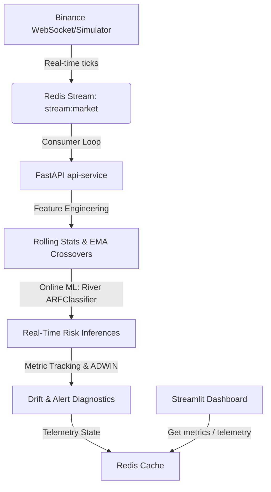

# ⚡ Cryptocurrency Flash Crash Predictor (Online ML)

A production-ready Online Machine Learning system that predicts sudden cryptocurrency flash crashes (>3% price drops in under 5 minutes) using streaming WebSocket market feeds and incremental learning algorithms.

---

## 🏗️ Architecture Flow



---

## 🛠️ Step-by-Step Execution Verification

To verify and run this project locally, complete the following commands in your workspace directory:

### 1. Build and Start the Docker Containers
```bash
docker compose up --build
```

This commands builds and launches three coordinated containers:
- **Redis Cache/Stream Broker** (`localhost:6379`)
- **FastAPI API & Ingest Service** (`localhost:8000`)
- **Streamlit Real-Time Monitoring Dashboard** (`localhost:8501`)

### 2. Launch the Streaming Ingestion Pipeline
Once the services are active, run the Binance collector to feed live real-time price updates into the Redis stream:
```bash
docker compose exec api-service python src/data/binance_collector.py
```

*Note: If the application container cannot connect to the live Binance endpoint, it automatically activates a mock random-walk crypto simulator to verify data flow, features creation, model learning, and dashboard updates.*

### 3. Open the UI Monitoring Dashboard
Navigate in your web browser to:
👉 **`http://localhost:8501`**

Here you'll see live prices updating in real-time, crash risk indexes calculated dynamically from the online Adaptive Random Forest model, and the concept drift status from ADWIN.

### 4. Run Automated Testing Suite
Ensure code stability by executing:
```bash
docker compose exec api-service pytest
```
